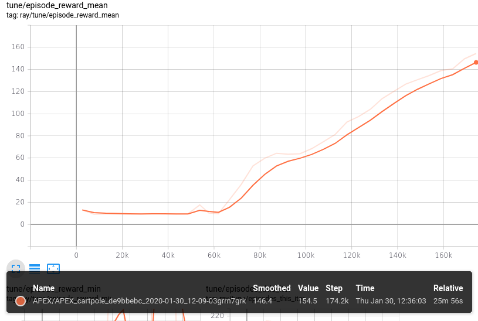

# carpole notes

ray 환경에 사용할 custom env/model 구성의 예로서 코드를 작성하였다. env는 openai gym의 cartpole을 기초로 wrapped env를 만들었으며, render 이미지를 obs로 되돌리도록 하였다. 모델은 atari에 적용한 vision net을 다시 keras로 구성하였다.

* ray.__version__: 0.8.0
* tf.__version__: 2.0 [tensorflow 2.1 won't work yet]
* run: $python cartpole_train.py

참고: 

* https://pytorch.org/tutorials/intermediate/reinforcement_q_learning.html
* https://github.com/openai/baselines/blob/master/baselines/common/atari_wrappers.py
* https://github.com/ray-project/ray/blob/master/rllib/models/tf/visionnet_v1.py
